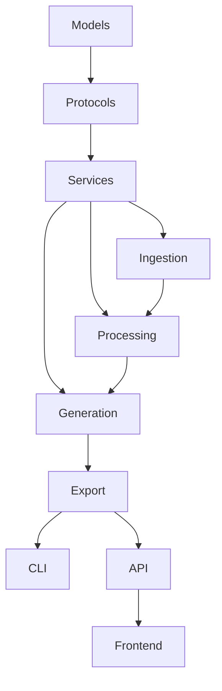

# MedAnki: Advanced Claude Code Workflows
## Maximizing Parallelization and Development Speed

This guide covers power-user techniques to get the most out of Claude Code for the MedAnki project.

---

## Table of Contents

1. [CLAUDE.md Project Context](#claudemd-project-context)
2. [Git Worktrees for Parallel Development](#git-worktrees-for-parallel-development)
3. [Multi-Instance Claude Code](#multi-instance-claude-code)
4. [Hooks for Automation](#hooks-for-automation)
5. [Task Batching Strategies](#task-batching-strategies)
6. [Pre-Computation & Caching](#pre-computation--caching)
7. [Prompt Templates & Slash Commands](#prompt-templates--slash-commands)
8. [Headless Mode for CI/CD](#headless-mode-for-cicd)
9. [Session Management](#session-management)
10. [Optimal Task Decomposition](#optimal-task-decomposition)
11. [Complete Parallel Workflow Example](#complete-parallel-workflow-example)

---

## 1. CLAUDE.md Project Context

The `CLAUDE.md` file is **the single most important optimization**. It's automatically loaded into context, giving Claude persistent project knowledge.

### Create Your CLAUDE.md

**File:** `CLAUDE.md` (project root)

```markdown
# MedAnki Project Context

## Project Overview
MedAnki converts medical education materials (PDFs, audio) into Anki flashcards with automatic MCAT/USMLE taxonomy tagging.

## Architecture
- **Monorepo** with uv workspaces
- **packages/core/** - Core Python library (ingestion, processing, generation, export)
- **packages/cli/** - Typer CLI application
- **packages/api/** - FastAPI backend with WebSocket
- **web/** - React + TypeScript + Vite frontend

## Tech Stack
- Python 3.11+, uv package manager
- FastAPI, Pydantic v2, aiosqlite
- React 18, TypeScript, TailwindCSS, React Query, Zustand
- Weaviate (vector DB), PubMedBERT embeddings
- Claude Sonnet 4 for generation
- genanki for Anki export

## Key Commands
```bash
# Install all dependencies
make install
# or: uv sync --all-extras

# Run tests
make test
# or: uv run pytest tests/ -v

# Lint and format
make lint format
# or: uv run ruff check . && uv run ruff format .

# Start dev servers
make dev-api    # FastAPI on :8000
make dev-web    # React on :5173

# Docker services
docker-compose -f docker/docker-compose.yml up -d  # Weaviate on :8080
```

## Code Standards
- Type hints everywhere (Python strict, TypeScript strict)
- Async/await for all I/O
- Pydantic models for data structures
- Protocol classes for dependency injection
- Google-style docstrings
- 100-char line limit

## File Naming Conventions
- Python: snake_case (e.g., `card_generator.py`)
- React: PascalCase (e.g., `FileUpload.tsx`)
- Tests: `test_*.py` or `*.test.tsx`

## Important Patterns

### Python Service Pattern
```python
from medanki.services.protocols import IGenerationService

class GenerationService(IGenerationService):
    def __init__(self, llm: LLMClient, validator: IValidationService):
        self._llm = llm
        self._validator = validator
    
    async def generate_cloze(self, chunk: ClassifiedChunk, count: int) -> list[ClozeCard]:
        # Implementation
```

### React Component Pattern
```tsx
interface Props { /* typed props */ }

export function Component({ prop }: Props) {
  const [state, setState] = useState<Type>(initial);
  // hooks, handlers, early returns
  return ( /* JSX */ );
}
```

## Current Sprint Focus
[Update this as you work]
- Phase X: Description
- Current chunk: X.Y

## Known Issues / TODOs
- [ ] Issue 1
- [ ] Issue 2

## Testing Notes
- Use VCR cassettes for LLM calls: `@pytest.mark.vcr()`
- Weaviate must be running for integration tests
- React tests use Vitest + Testing Library

## Environment Variables
Required:
- `ANTHROPIC_API_KEY` - Claude API

Optional:
- `WEAVIATE_URL` - Default: http://localhost:8080
- `MEDANKI_DEBUG` - Enable debug logging
```

### Tips for CLAUDE.md
1. **Keep it updated** - Add current sprint focus, known issues
2. **Include examples** - Code patterns Claude should follow
3. **List key files** - Point to important reference files
4. **Add gotchas** - Things that commonly cause issues

---

## 2. Git Worktrees for Parallel Development

**Git worktrees let you work on multiple branches simultaneously** in separate directories, each with its own Claude Code instance.

### Setup Worktrees

```bash
# From your main repo
cd medanki

# Create worktrees for parallel work
git worktree add ../medanki-api feature/api-endpoints
git worktree add ../medanki-frontend feature/react-frontend
git worktree add ../medanki-tests feature/test-suite
git worktree add ../medanki-generation feature/card-generation
```

### Directory Structure

```
~/projects/
├── medanki/                    # Main branch (core library)
├── medanki-api/                # API development
├── medanki-frontend/           # React frontend
├── medanki-tests/              # Test writing
└── medanki-generation/         # Generation layer
```

### Launch Parallel Claude Code Instances

```bash
# Terminal 1 - Core library
cd ~/projects/medanki
claude

# Terminal 2 - API
cd ~/projects/medanki-api
claude

# Terminal 3 - Frontend
cd ~/projects/medanki-frontend
claude

# Terminal 4 - Tests
cd ~/projects/medanki-tests
claude
```

### Worktree Management Commands

```bash
# List all worktrees
git worktree list

# Remove worktree when done
git worktree remove ../medanki-api

# Prune stale worktree references
git worktree prune
```

### Merge Strategy

```bash
# When features are ready, merge back to main
cd ~/projects/medanki  # Main repo

git merge feature/api-endpoints
git merge feature/react-frontend
# etc.

# Or use PRs for code review
```

---

## 3. Multi-Instance Claude Code

### Optimal Instance Allocation

| Instance | Worktree | Agent Focus | Tasks |
|----------|----------|-------------|-------|
| 1 | main | `@python-backend` | Core library, models, services |
| 2 | feature/api | `@python-backend` | FastAPI routes, WebSocket |
| 3 | feature/frontend | `@react-frontend` | React components, pages |
| 4 | feature/tests | `@test-engineer` | Tests for all layers |

### Resource Considerations

- Each Claude Code instance uses ~200-500MB RAM
- 4 instances is comfortable on 16GB RAM
- 6+ instances on 32GB RAM
- Consider using `--max-tokens` flag to limit context if needed

### Tmux/Screen for Organization

```bash
# Create tmux session with panes
tmux new-session -s medanki \; \
  split-window -h \; \
  split-window -v \; \
  select-pane -t 0 \; \
  split-window -v \; \
  select-pane -t 0

# Or use a tmuxinator config
# ~/.tmuxinator/medanki.yml
```

**tmuxinator config:**
```yaml
# ~/.tmuxinator/medanki.yml
name: medanki
root: ~/projects

windows:
  - development:
      layout: tiled
      panes:
        - core:
            - cd medanki
            - claude
        - api:
            - cd medanki-api
            - claude
        - frontend:
            - cd medanki-frontend
            - claude
        - tests:
            - cd medanki-tests
            - claude
```

Launch with: `tmuxinator start medanki`

---

## 4. Hooks for Automation

Claude Code hooks automate repetitive tasks.

### Create Hooks Directory

```bash
mkdir -p .claude/hooks
```

### Pre-Commit Hook: Auto-Lint

**File:** `.claude/hooks/pre-commit.sh`

```bash
#!/bin/bash
# Auto-format and lint before Claude commits

echo "🔍 Running pre-commit checks..."

# Python
uv run ruff check --fix .
uv run ruff format .

# TypeScript (if in web/)
if [ -d "web" ]; then
  cd web && npm run lint:fix && cd ..
fi

echo "✅ Pre-commit checks complete"
```

### Post-Task Hook: Auto-Test

**File:** `.claude/hooks/post-task.sh`

```bash
#!/bin/bash
# Run relevant tests after Claude completes a task

CHANGED_FILES=$(git diff --name-only HEAD~1)

# If Python files changed, run Python tests
if echo "$CHANGED_FILES" | grep -q "\.py$"; then
  echo "🧪 Running Python tests..."
  uv run pytest tests/unit -v --tb=short -q
fi

# If React files changed, run React tests
if echo "$CHANGED_FILES" | grep -q "web/src/"; then
  echo "🧪 Running React tests..."
  cd web && npm test -- --run && cd ..
fi
```

### File Watcher Hook

**File:** `.claude/hooks/on-file-change.sh`

```bash
#!/bin/bash
# Triggered when files change

FILE=$1

case "$FILE" in
  *.py)
    uv run ruff check "$FILE" --fix
    ;;
  *.tsx|*.ts)
    cd web && npx eslint "$FILE" --fix && cd ..
    ;;
  packages/core/src/medanki/models/*)
    echo "📝 Model changed - consider updating tests"
    ;;
esac
```

---

## 5. Task Batching Strategies

### Batch Independent Tasks

Instead of:
```
> Implement the Document model
[wait]
> Implement the Chunk model
[wait]
> Implement the Card model
[wait]
```

Do this (in one prompt):
```
Implement all domain models in packages/core/src/medanki/models/:

1. **document.py**: Document, Section, MedicalEntity dataclasses
2. **chunk.py**: Chunk, TopicMatch, ClassifiedChunk dataclasses  
3. **cards.py**: ClozeCard, VignetteCard with validators
4. **enums.py**: ExamType, ContentType, CardType enums

Follow the patterns in the test specification (medanki_test_specification.py).
Create all files, then run tests to verify.
```

### Batch by Layer

```
# Instance 1: All ingestion layer
Implement the complete ingestion layer:
- packages/core/src/medanki/ingestion/pdf.py (Marker integration)
- packages/core/src/medanki/ingestion/text.py (plain text/markdown)
- packages/core/src/medanki/ingestion/normalizer.py (unified Document factory)
- packages/core/src/medanki/ingestion/service.py (facade)

Reference the test specification for expected behavior.
Create tests in tests/unit/ingestion/ as you go.
```

### Parallel Batches Across Instances

**Instance 1 (main):**
```
Implement Phase 4: Processing Layer - Chunking
All chunks 4.1 through 4.5
```

**Instance 2 (feature/embeddings):**
```
Implement Phase 5: Embeddings & Vector Store
All chunks 5.1 through 5.4
```

**Instance 3 (feature/classification):**
```
Implement Phase 6: Classification
All chunks 6.1 through 6.4
```

---

## 6. Pre-Computation & Caching

### Pre-Generate Boilerplate

Before starting Claude Code, generate scaffolding:

```bash
#!/bin/bash
# scripts/scaffold.sh - Generate project structure

# Create all directories
mkdir -p packages/core/src/medanki/{models,ingestion,processing,generation,export,services,storage}
mkdir -p packages/cli/src/medanki_cli/commands
mkdir -p packages/api/src/medanki_api/{routes,websocket,workers,schemas}
mkdir -p web/src/{components,pages,hooks,api,stores}
mkdir -p tests/{unit,integration,e2e}/{models,ingestion,processing,generation,export}
mkdir -p data/taxonomies
mkdir -p .claude/agents

# Create __init__.py files
find packages -type d -exec touch {}/__init__.py \;

# Create placeholder files
touch packages/core/src/medanki/models/{enums,document,chunk,cards,results}.py
touch packages/core/src/medanki/services/{protocols,config,taxonomy,llm,cache}.py
# ... etc

echo "✅ Scaffold complete"
```

### Pre-Load Taxonomy Data

```bash
# Download and format taxonomy JSONs before Claude needs them
# scripts/setup-taxonomies.sh

# MCAT taxonomy
cat > data/taxonomies/mcat.json << 'EOF'
{
  "exam": "MCAT",
  "foundational_concepts": [
    {
      "id": "FC1",
      "title": "Biomolecules have unique properties...",
      "categories": [
        {"id": "1A", "title": "Structure and function of proteins..."},
        {"id": "1B", "title": "Transmission of genetic information..."}
      ]
    }
  ]
}
EOF
```

### Cache Expensive Operations

Add to CLAUDE.md:
```markdown
## Cached Resources
- Taxonomy embeddings: `data/cache/taxonomy_embeddings.pkl`
- scispaCy model: Pre-downloaded to `~/.cache/scispacy/`
- Test fixtures: `data/test_fixtures/`

Run `make setup-cache` to pre-populate caches before development.
```

---

## 7. Prompt Templates & Slash Commands

### Custom Slash Commands

**File:** `.claude/commands/implement-service.md`

```markdown
---
name: implement-service
description: Implement a service class following project patterns
args:
  - name: service_name
    description: Name of the service (e.g., ChunkingService)
  - name: protocol
    description: Protocol interface to implement
---

Implement the {{service_name}} class that implements {{protocol}}.

Follow these steps:
1. Read the protocol definition in `packages/core/src/medanki/services/protocols.py`
2. Check the test specification for expected behavior
3. Create the implementation in the appropriate module
4. Add comprehensive docstrings
5. Write unit tests
6. Run `uv run pytest tests/unit -v -k {{service_name}}` to verify

Use dependency injection for all dependencies.
```

**Usage:**
```
/implement-service ChunkingService IChunkingService
```

### More Slash Commands

**File:** `.claude/commands/create-component.md`
```markdown
---
name: create-component
description: Create a React component with tests
args:
  - name: component_name
---

Create the {{component_name}} React component:

1. Create `web/src/components/{{component_name}}.tsx`
2. Follow the component pattern from CLAUDE.md
3. Use TypeScript strict mode
4. Add Tailwind classes for styling
5. Create `web/src/components/__tests__/{{component_name}}.test.tsx`
6. Run `cd web && npm test -- --run` to verify
```

**File:** `.claude/commands/add-endpoint.md`
```markdown
---
name: add-endpoint
description: Add a FastAPI endpoint
args:
  - name: method
  - name: path
  - name: description
---

Add {{method}} {{path}} endpoint:

1. Add route to appropriate router in `packages/api/src/medanki_api/routes/`
2. Create request/response schemas in `schemas/`
3. Add OpenAPI documentation
4. Write integration test
5. Update API documentation
```

---

## 8. Headless Mode for CI/CD

### Run Claude Code in CI

```yaml
# .github/workflows/claude-review.yml
name: Claude Code Review

on:
  pull_request:
    types: [opened, synchronize]

jobs:
  review:
    runs-on: ubuntu-latest
    steps:
      - uses: actions/checkout@v4
      
      - name: Setup Claude Code
        run: |
          npm install -g @anthropic-ai/claude-code
          
      - name: Run Claude Review
        env:
          ANTHROPIC_API_KEY: ${{ secrets.ANTHROPIC_API_KEY }}
        run: |
          claude --headless --print "Review this PR for:
          1. Code quality issues
          2. Missing tests
          3. Security concerns
          4. Performance issues
          
          Files changed:
          $(git diff --name-only origin/main...HEAD)
          
          Output a markdown summary."
```

### Batch Processing Script

```bash
#!/bin/bash
# scripts/batch-implement.sh
# Run Claude Code in headless mode for batch tasks

TASKS=(
  "Implement Document model in packages/core/src/medanki/models/document.py"
  "Implement Chunk model in packages/core/src/medanki/models/chunk.py"
  "Implement Card models in packages/core/src/medanki/models/cards.py"
)

for task in "${TASKS[@]}"; do
  echo "📝 Task: $task"
  claude --headless --print "$task. Follow patterns in CLAUDE.md. Output only the code."
  echo "---"
done
```

---

## 9. Session Management

### Save/Resume Sessions

```bash
# Save current session
claude session save medanki-phase4

# List saved sessions
claude session list

# Resume session
claude session resume medanki-phase4
```

### Session Naming Convention

```
medanki-{phase}-{chunk}
medanki-phase4-chunking
medanki-phase7-generation
medanki-api-websocket
medanki-frontend-upload
```

### Context Checkpointing

Add to your workflow:
```markdown
## Context Checkpoint

### Completed
- [x] Phase 1: Models
- [x] Phase 2: Services
- [x] Phase 3: Ingestion

### Current
- Phase 4, Chunk 4.3: Medical term preservation

### Next
- Phase 4, Chunk 4.4: Entity extraction

### Key Decisions Made
1. Using 512 token chunks with 75 token overlap
2. Hybrid search alpha = 0.5 for abbreviations
3. AnKing tag format for USMLE compatibility
```

---

## 10. Optimal Task Decomposition

### The "Just Right" Task Size

| Too Small ❌ | Just Right ✅ | Too Large ❌ |
|-------------|--------------|-------------|
| "Add import statement" | "Implement the PDF extractor with Marker" | "Build the entire processing layer" |
| "Fix typo" | "Create FileUpload component with drag-drop" | "Build the complete frontend" |
| "Add one test" | "Write tests for the ChunkingService" | "Write all tests for the project" |

### Decomposition Formula

```
1 Task = 1 Service/Component + Its Tests + Its Documentation

Time: 15-45 minutes
Lines: 100-500 lines of code
Files: 1-3 files
```

### Dependency-Aware Ordering



**Parallel opportunities:**
- Models + Protocols (same instance)
- Ingestion || Processing setup (different instances)
- CLI || API || Frontend (different instances)
- Tests can run in parallel throughout

---

## 11. Complete Parallel Workflow Example

### Day 1: Foundation (4 instances)

**Instance 1 - Models & Protocols:**
```
@python-backend Implement all domain models and protocols:
1. models/enums.py - All enumerations
2. models/document.py - Document, Section, MedicalEntity
3. models/chunk.py - Chunk, TopicMatch, ClassifiedChunk
4. models/cards.py - ClozeCard, VignetteCard with validators
5. services/protocols.py - All 9 protocol interfaces

Reference medanki_test_specification.py for exact requirements.
```

**Instance 2 - Shared Services:**
```
@python-backend Implement shared services:
1. services/config.py - Pydantic settings
2. services/cache.py - In-memory and disk cache
3. storage/sqlite.py - Async SQLite with schema

Use the protocols from Instance 1 (will be merged).
```

**Instance 3 - React Setup:**
```
@react-frontend Set up complete React project structure:
1. Configure Vite, TypeScript, Tailwind
2. Set up React Router with all routes
3. Create API client with React Query
4. Create Zustand store
5. Create Layout component

Follow web app design doc for structure.
```

**Instance 4 - Test Infrastructure:**
```
@test-engineer Set up test infrastructure:
1. Configure pytest with asyncio
2. Create conftest.py with fixtures
3. Set up VCR for API mocking
4. Create mock implementations
5. Write first model tests

Use medanki_test_specification.py as reference.
```

### Day 2: Core Pipeline (4 instances)

**Instance 1 - Ingestion:**
```
@python-backend Implement complete ingestion layer
```

**Instance 2 - Chunking + Embeddings:**
```
@python-backend @medical-nlp Implement chunking and embedding:
- ChunkingService with medical term preservation
- EmbeddingService with PubMedBERT
- Weaviate vector store integration
```

**Instance 3 - Classification:**
```
@medical-nlp Implement classification layer:
- Taxonomy service with embeddings
- Hybrid search classifier
- Multi-label assignment
```

**Instance 4 - Tests:**
```
@test-engineer Write tests for all Day 2 work:
- Ingestion tests
- Chunking tests  
- Embedding tests
- Classification tests
```

### Day 3: Generation + Export (4 instances)

**Instance 1 - Generation:**
```
@python-backend Implement generation layer:
- Cloze generator with prompts
- Vignette generator
- Card validator
- Deduplicator
```

**Instance 2 - Export:**
```
@anki-specialist Implement export layer:
- Tag builder (AnKing format)
- Genanki models and deck builder
- APKG exporter
```

**Instance 3 - CLI:**
```
@python-backend Implement CLI:
- Typer app structure
- generate command
- taxonomy commands
- config commands
```

**Instance 4 - Tests:**
```
@test-engineer Write tests for Day 3:
- Generation tests with VCR
- Export tests
- CLI integration tests
```

### Day 4-5: API + Frontend (4 instances)

**Instance 1 - FastAPI:**
```
@python-backend Implement FastAPI backend:
- All routes (upload, jobs, download, preview)
- WebSocket progress
- Background processor
```

**Instance 2 - React Pages:**
```
@react-frontend Implement all pages:
- UploadPage with FileUpload
- ProcessingPage with WebSocket
- DownloadPage with preview
```

**Instance 3 - React Components:**
```
@react-frontend Implement components:
- FileUpload (drag-drop)
- ProgressBar, StepList
- CardPreview, CardList
- Error handling
```

**Instance 4 - Integration Tests:**
```
@test-engineer Write integration and E2E tests:
- API integration tests
- Frontend E2E with Playwright
- Full pipeline test
```

---

## Quick Reference Card

### Setup Commands
```bash
# Create worktrees
git worktree add ../medanki-{name} feature/{name}

# Add MCP
claude mcp add {name} -- {command}

# Add agent
claude agent add {name}  # Then paste content
```

### Instance Launch
```bash
# Parallel instances
cd ~/projects/medanki && claude &
cd ~/projects/medanki-api && claude &
cd ~/projects/medanki-frontend && claude &
cd ~/projects/medanki-tests && claude &
```

### Task Template
```
@{agent} Implement {component}:
1. {specific file/class 1}
2. {specific file/class 2}
3. {specific file/class 3}

Reference: {key files}
Tests: Write in {test location}
Verify: {test command}
```

### Merge Workflow
```bash
# From main branch
git merge feature/api-endpoints --no-ff
git merge feature/react-frontend --no-ff
git push origin main
```

---

## Performance Tips

1. **CLAUDE.md is king** - Keep it comprehensive and updated
2. **Batch related tasks** - Fewer, larger prompts > many small ones
3. **Use worktrees** - True parallelization, not just multitasking
4. **Pre-generate scaffolding** - Less boilerplate for Claude to write
5. **Hooks automate quality** - Lint/test automatically
6. **Slash commands standardize** - Consistent task execution
7. **Save sessions** - Don't lose context on complex tasks
8. **Test in parallel** - Dedicated instance for test writing

---

*Document version: 1.0 | Last updated: December 2025*
