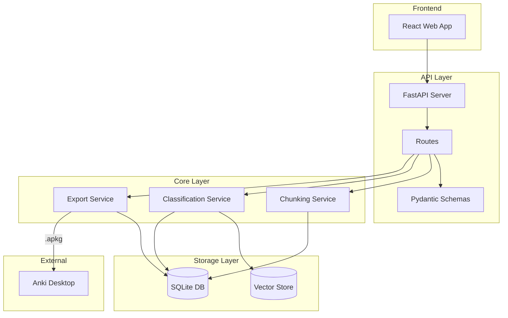
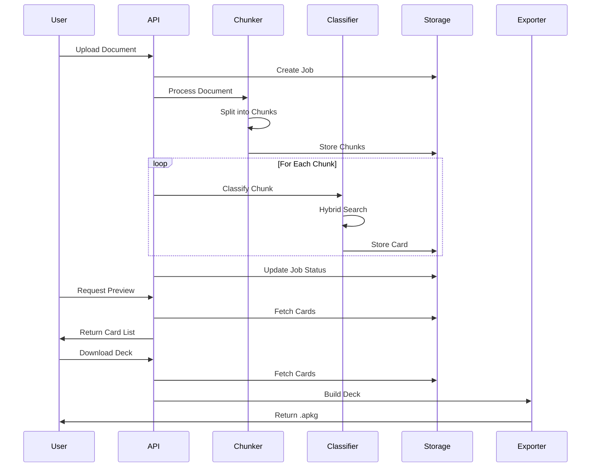

# Architecture

## System Overview



## Layer Descriptions

### Frontend Layer

The React-based web application provides:
- Document upload interface
- Real-time job progress monitoring
- Card preview and editing
- Deck download functionality

### API Layer (`packages/api`)

FastAPI-based REST API providing:
- **Preview Routes** - Card listing with filtering and pagination
- **Download Routes** - Deck export and job statistics
- **WebSocket** - Real-time progress updates (planned)

### Core Layer (`packages/core`)

#### Processing Module

**ChunkingService** (`processing/chunker.py`)
- Token-aware text splitting using tiktoken
- Medical term protection (preserves lab values, drug doses, anatomical terms)
- Section-aware chunking respects document structure
- Configurable chunk size (default: 512 tokens) and overlap (default: 75 tokens)

**ClassificationService** (`processing/classifier.py`)
- Hybrid search combining semantic and keyword matching
- Dual-threshold filtering (base: 0.65, relative: 0.80)
- Multi-label classification for MCAT/USMLE topics
- Automatic exam type detection

#### Export Module

**DeckBuilder** (`export/deck.py`)
- Creates Anki decks with hierarchical naming
- Supports cloze and vignette card types
- Generates stable GUIDs for deduplication

**APKGExporter** (`export/apkg.py`)
- Wraps genanki library for .apkg generation
- Supports media file embedding
- Single and multi-deck export

**TagBuilder** (`export/tags.py`)
- MCAT tag format: `#MCAT::Category::Subcategory`
- USMLE tag format: `#AK_Step1_v12::System::Topic`
- Source attribution tags

#### Storage Module

**SQLiteStore** (`storage/sqlite.py`)
- Async SQLite with aiosqlite
- Tables: documents, chunks, cards, jobs
- Foreign key relationships with cascade delete
- Content hash indexing for deduplication

## Data Flow



## Key Design Decisions

### Medical Term Protection

The chunker identifies and protects:
- Lab values: `12.5 mg/dL`, `150,000 x10^9/L`
- Drug doses: `Metoprolol 25 mg`
- Anatomical terms: `left anterior descending artery`

This prevents mid-term splits that would create nonsensical cards.

### Dual-Threshold Classification

Cards must pass two thresholds:
1. **Base threshold (0.65)** - Minimum confidence
2. **Relative threshold (0.80)** - Must be within 80% of top score

This balances precision (avoiding wrong topics) with recall (allowing multi-topic cards).

### Hierarchical Deck Structure

Decks use Anki's `::` hierarchy:
```
MedAnki::MCAT::Biology::Cell Biology
MedAnki::USMLE::Step1::Cardiovascular
```

Enabling focused study by topic while maintaining organization.

### Content Hashing

Each card's content is SHA-256 hashed for:
- Duplicate detection across documents
- Stable identification for updates
- Efficient indexing

## Database Schema

```sql
documents (id, source_path, content_type, raw_text, metadata, created_at)
chunks (id, document_id, text, start_char, end_char, token_count, section_path)
cards (id, document_id, chunk_id, card_type, content, content_hash, tags, status, created_at)
jobs (id, document_id, status, progress, error, created_at, updated_at)
```

## Taxonomy System

The taxonomy system provides hierarchical classification for MCAT and USMLE topics.

### TaxonomyServiceV2

The `TaxonomyServiceV2` provides high-level taxonomy operations with SQLite backend:

```python
async with TaxonomyServiceV2(db_path, vector_store) as service:
    node = await service.get_node("1A")
    ancestors = await service.get_ancestors("1A")
    descendants = await service.get_descendants("FC1", max_depth=2)
```

### Closure Table Pattern

The taxonomy uses a closure table (`taxonomy_edges`) for efficient hierarchy queries:
- O(1) ancestor/descendant lookups
- Single query for full path retrieval
- Efficient subtree operations

### MeSH Integration

Medical Subject Headings (MeSH) vocabulary is integrated for:
- Synonym expansion during search
- Medical term normalization
- Cross-referencing with NIH terminology

See [taxonomy.md](taxonomy.md) for detailed taxonomy documentation.
